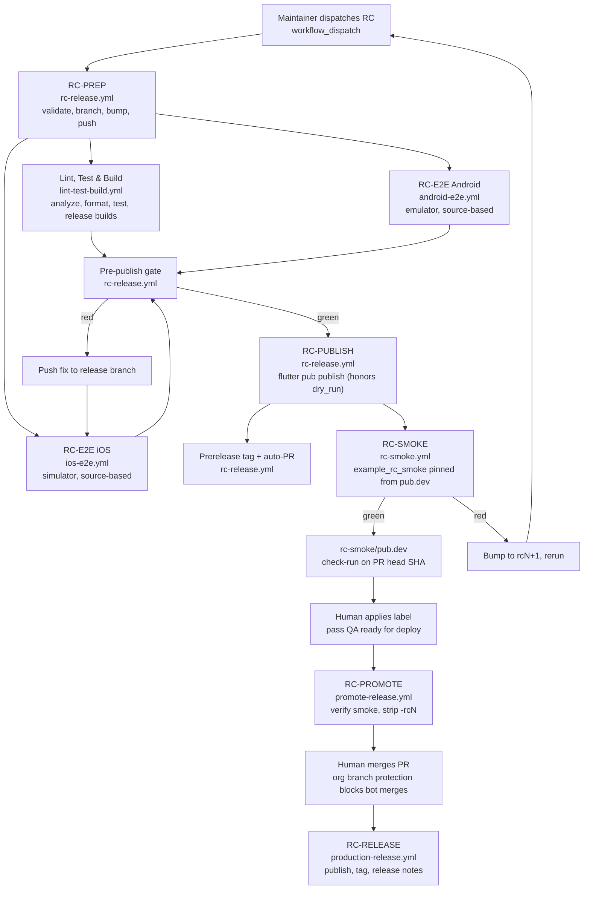

# Release process tech design

A reusable RC-to-Production pipeline for a Flutter plugin repository, grounded in the workflow files under `.github/workflows/` and aligned with the contracts in `appsflyer-mobile-plugin-tooling/contracts/`. Use this document as the blueprint when porting the same approach to other plugins (React Native, Cordova, Capacitor, Unity, future stacks).

## Table of contents

- [Purpose and scope](#purpose-and-scope)
- [Source of truth](#source-of-truth)
- [Terminology](#terminology)
- [Architecture](#architecture)
  - [High-level flow (flowchart)](#high-level-flow-flowchart)
  - [End-to-end progression (sequence)](#end-to-end-progression-sequence)
- [Lifecycle stages](#lifecycle-stages)
- [Workflow and job matrix](#workflow-and-job-matrix)
- [Artifacts and state transitions](#artifacts-and-state-transitions)
- [Gates and decision points](#gates-and-decision-points)
- [Runner selection rationale](#runner-selection-rationale)
- [Dependencies and integrations](#dependencies-and-integrations)
- [Failure modes and mitigations](#failure-modes-and-mitigations)
- [How another plugin should adopt this pipeline](#how-another-plugin-should-adopt-this-pipeline)

## Purpose and scope

This document explains the end-to-end release pipeline that runs from `.github/workflows/rc-release.yml` (the entry point) to `.github/workflows/production-release.yml` (the terminal stage), covering everything in between: source-based E2E, RC publish, registry-pinned smoke, promotion, and production publish.

**In scope.** RC trigger, build, test, package, publish, post-publish smoke, promotion, production publish, GitHub release creation, and notifications.

**Out of scope.** Hotfix flows without an RC suffix, rollback, backports, release-note authorship, code signing, App Store/Play Store submission. The provided workflows publish to a package registry only (pub.dev for Flutter); store distribution lives outside this pipeline.

## Source of truth

- Stage definitions: `appsflyer-mobile-plugin-tooling/contracts/rc-release-contract.md`
- E2E meaning: `appsflyer-mobile-plugin-tooling/contracts/e2e-test-contract.md`
- Smoke meaning: `appsflyer-mobile-plugin-tooling/contracts/smoke-test-contract.md`
- Test app behavior: `appsflyer-mobile-plugin-tooling/contracts/test-app-contract.md`
- Reference workflows in this repo:
  - `.github/workflows/rc-release.yml`
  - `.github/workflows/lint-test-build.yml`
  - `.github/workflows/ios-e2e.yml`
  - `.github/workflows/android-e2e.yml`
  - `.github/workflows/rc-smoke.yml`
  - `.github/workflows/promote-release.yml`
  - `.github/workflows/production-release.yml`
- Operator guide: `docs/RELEASE_USER_MANUAL.md`
- Cursor rule pointer: `.cursor/rules/rc-release-pipeline.mdc`

The tooling repo defines what each stage must prove. Each plugin owns how it builds, runs, publishes, and maps version files. Stage IDs (`RC-PREP`, `RC-E2E`, `RC-PUBLISH`, `RC-SMOKE`, `RC-PROMOTE`, `RC-RELEASE`) are stable across plugins.

## Terminology

- **RC** (release candidate): a build produced from a `releases/...` branch with version `X.Y.Z[-rcN]`.
- **Production**: the published `X.Y.Z` artifact on the registry, plus a GitHub release tagged `X.Y.Z`.
- **Artifact**: anything produced by a job that a later job or human consumes (registry package, GitHub check-run, release branch commit, JSON report, App Bundle, IPA archive).
- **Gate**: a binary pass/fail decision point that blocks downstream stages.
- **Runner**: a GitHub Actions execution host (`ubuntu-latest`, `macos-15`).
- **Environment**: a GitHub Environment (with optional protection rules and scoped secrets). The reference pipeline uses repo-level secrets only; Environments are not configured.
- **Promotion**: the act of stripping `-rcN` from version surfaces on the release branch so a clean `X.Y.Z` merge commit lands on `master`.

## Architecture

### High-level flow (flowchart)



### End-to-end progression (sequence)

```mermaid
sequenceDiagram
    autonumber
    actor Dev as Maintainer
    participant RC as rc-release.yml
    participant LTB as lint-test-build.yml
    participant E2E as ios-e2e.yml + android-e2e.yml
    participant Pub as pub.dev
    participant Smoke as rc-smoke.yml
    participant GH as GitHub (Checks/PR)
    actor QA as QA / Reviewer
    participant Prom as promote-release.yml
    participant Prod as production-release.yml

    Dev->>RC: workflow_dispatch (version, SDKs, dry_run)
    RC->>RC: validate-release; prepare-branch (push releases/...)
    par parallel
        RC->>LTB: workflow_call (skip_unit, skip_builds)
    and
        RC->>E2E: workflow_call (ref=release_branch)
    end
    LTB-->>RC: success or skipped
    E2E-->>RC: success required
    RC->>RC: pre-publish-gate aggregates
    RC->>Pub: flutter pub publish --force (if not dry_run)
    RC->>GH: prerelease tag, auto-PR to master
    Pub-->>Smoke: workflow_run on RC success
    Smoke->>Pub: poll versions until RC visible
    Smoke->>Smoke: synthesize example_rc_smoke, run SMOKE-001..003
    Smoke->>GH: post check-run rc-smoke/pub.dev on head SHA
    QA->>GH: apply label "pass QA ready for deploy"
    GH-->>Prom: pull_request: labeled
    Prom->>GH: verify rc-smoke/pub.dev == success
    Prom->>Prom: strip -rcN, push to release branch
    QA->>GH: review and merge PR (manual)
    GH-->>Prod: pull_request: closed (merged)
    Prod->>Pub: flutter pub publish (production)
    Prod->>GH: create release X.Y.Z, notify Slack/Jira
```

## Lifecycle stages

Each stage maps to a stable ID from the tooling contract and to a specific YAML file in this repo.

| Stage | Owner YAML | Trigger | Responsibility | Pass condition |
|---|---|---|---|---|
| `RC-PREP` | `.github/workflows/rc-release.yml` (jobs `validate-release`, `prepare-branch`) | `workflow_dispatch` | Validates RC inputs, computes the release branch path, updates every version surface (`pubspec.yaml`, `android/build.gradle`, `ios/appsflyer_sdk.podspec`, native plugin constants, `README.md`), commits, and pushes. | Inputs match the documented regexes; the release branch exists on origin; the version-bump commit is reachable from the branch head. |
| `RC-E2E` | `.github/workflows/ios-e2e.yml`, `.github/workflows/android-e2e.yml` | `workflow_call` from `rc-release.yml`; manual dispatch and weekly cron also fire. | Builds the example app linked to plugin source via `path: ..` and runs `.af-e2e/test-plan.json` through `scripts/af-scenario-runner.sh`. | Both platform jobs conclude `success`. |
| `RC-PUBLISH` | `.github/workflows/rc-release.yml` (`publish-rc`) | After `pre-publish-gate` passes | Runs `flutter pub publish --dry-run`; on a real run, writes `PUB_DEV_CREDENTIALS` and runs `flutter pub publish --force`. | Dry-run validation exits 0 or 65 (warnings only); when `dry_run=false`, real publish exits 0. |
| `RC-SMOKE` | `.github/workflows/rc-smoke.yml` | `workflow_run` on `RC - Release Candidate` completion; manual dispatch with `rc_version` + `release_branch` for reruns. | Polls pub.dev until the RC version is visible (max 15 min), synthesizes `example_rc_smoke/` from `example/`, pins `appsflyer_sdk: <X.Y.Z-rcN>` from pub.dev, runs `SMOKE-001`, `SMOKE-002`, `SMOKE-003` on iOS and Android, and posts the `rc-smoke/pub.dev` check-run on the release branch head SHA. | Both platform smoke jobs are `success` and the check-run is posted with conclusion `success`. |
| `RC-PROMOTE` | `.github/workflows/promote-release.yml` | `pull_request: labeled` with label `pass QA ready for deploy` on a `releases/*` head | Verifies the latest `rc-smoke/pub.dev` check-run on the PR head SHA is `success`, strips `-rcN` from version surfaces, commits, pushes, updates the PR description and posts a comment. Does not merge (org branch protection blocks bot merges). | Smoke check-run is `success`; version-strip push succeeds. |
| `RC-RELEASE` | `.github/workflows/production-release.yml` | `pull_request: closed` (merged from `releases/*` to `master`); also `workflow_dispatch` and `workflow_call`. | Reads the production version from `pubspec.yaml`, runs `flutter pub publish --force`, polls pub.dev for visibility, extracts release notes from `CHANGELOG.md`, creates the GitHub release `X.Y.Z`, and sends Slack notifications with Jira `fixVersion` lookup. | Publish succeeds; GitHub release is created. |

## Workflow and job matrix

| Workflow / job | Trigger | Runner | Key outputs | Gating conditions |
|---|---|---|---|---|
| `rc-release.yml / validate-release` | `workflow_dispatch` | `ubuntu-latest` | `version`, `base_version`, `podspec_version`, `release_branch`, `ios_sdk_version`, `android_sdk_version`, `is_dry_run` | `flutter_version` matches `^[0-9]+\.[0-9]+\.[0-9]+(\+[0-9]+)?-rc[0-9]+$`; native SDK versions match `X.Y.Z`. |
| `rc-release.yml / prepare-branch` | After `validate-release` | `ubuntu-latest` | `release_branch` (with version-bump commit pushed) | Runs only when inputs are valid. |
| `rc-release.yml / run-ci` | After `validate-release`, `workflow_call` to `lint-test-build.yml` | Reusable | CI conclusion (consumed by gate) | `success` or `skipped` passes the gate. |
| `lint-test-build.yml / test` | PR to `development`/`master`, push, dispatch, `workflow_call` | `ubuntu-latest` | Coverage upload | `flutter analyze --no-fatal-infos`, `dart format --set-exit-if-changed`, `flutter test --coverage`. Skippable via `skip_unit=true`. |
| `lint-test-build.yml / build-android` | After `test` | `ubuntu-latest` (Java 17) | `android-appbundle-release` artifact, retention 7 days | Runs when `test` is `success` or `skipped` and `skip_builds=false`. |
| `lint-test-build.yml / build-ios` | After `test` | `macos-15` | `ios-app-unsigned` artifact, retention 7 days | Runs when `test` is `success` or `skipped` and `skip_builds=false`. |
| `ios-e2e.yml / e2e-ios` | `workflow_call` from RC, dispatch, `cron: '0 2 * * 0'` | `macos-15` | `ios-e2e-<run_number>` artifact, retention 30 days | All checks in `.af-e2e/test-plan.json` pass. |
| `android-e2e.yml / e2e-android` | `workflow_call` from RC, dispatch, `cron: '0 3 * * 0'` | `ubuntu-latest` + `reactivecircus/android-emulator-runner@v2` | `android-e2e-<run_number>` artifact, retention 30 days | All checks in `.af-e2e/test-plan.json` pass. |
| `rc-release.yml / pre-publish-gate` | After CI + both E2E jobs | `ubuntu-latest` | `passed`, individual leg results | iOS E2E `success` + Android E2E `success` + CI (`success` or `skipped`). Anything else fails the gate. |
| `rc-release.yml / publish-rc` | After gate | `ubuntu-latest` | Published RC on pub.dev (when `dry_run=false`) | Gate `passed=true`; `PUB_DEV_CREDENTIALS` required for real publish. |
| `rc-release.yml / create-prerelease` | After `publish-rc` | `ubuntu-latest` | GitHub prerelease + tag `<version>` | `publish-rc` is `success`. |
| `rc-release.yml / open-pr` | After `publish-rc` | `ubuntu-latest` | PR from release branch to `master` | `publish-rc` is `success`. |
| `rc-release.yml / notify-team` | After all RC jobs | `ubuntu-latest` | Slack message (success or failure variant), Jira ticket lookup | Skips Slack on dry-run runs. |
| `rc-smoke.yml / resolve` | `workflow_run` (RC complete) or dispatch | `ubuntu-latest` | `should_run`, `skip_reason`, `rc_version`, `release_branch`, `head_sha` | Skips when parent failed, version is not `-rcN`, or RC not visible on pub.dev within 15 min. |
| `rc-smoke.yml / smoke-ios` | After `resolve` | `macos-15` | `rc-smoke-ios-<run_number>` artifact, retention 30 days | `SMOKE-001/002/003` pass on iOS simulator. |
| `rc-smoke.yml / smoke-android` | After `resolve` | `ubuntu-latest` + Android emulator | `rc-smoke-android-<run_number>` artifact, retention 30 days | `SMOKE-001/002/003` pass on Android emulator. |
| `rc-smoke.yml / post-check-run` | After both smoke jobs | `ubuntu-latest` | `rc-smoke/pub.dev` check-run on head SHA | Both smoke jobs `success` to post `success`; otherwise `failure`. |
| `rc-smoke.yml / post-skipped-check` | When `should_run=false` | `ubuntu-latest` | `rc-smoke/pub.dev` skipped check-run | Reason recorded: `parent_not_success`, `not_rc_version`, or `not_on_pubdev`. |
| `promote-release.yml / prepare-for-production` | `pull_request: labeled` (`pass QA ready for deploy`) on `releases/*` head | `ubuntu-latest` | Strip-`-rcN` commit, updated PR body, PR comment | Latest `rc-smoke/pub.dev` on `pull_request.head.sha` is `success`. `skipped` is rejected. |
| `production-release.yml / validate-release` | PR merged to `master` from `releases/*`, dispatch, `workflow_call` | `ubuntu-latest` | `version`, `is_valid`, `is_dry_run` | PR merged from `releases/*`; version matches `X.Y.Z(+build)?`; tag does not already exist (unless `dry_run`). |
| `production-release.yml / publish-to-pubdev` | After validation | `ubuntu-latest` | Production package on pub.dev, post-publish visibility check | Dry-run validation passes; `PUB_DEV_CREDENTIALS` required for real publish. |
| `production-release.yml / create-github-release` | After publish | `ubuntu-latest` | GitHub release `X.Y.Z` with assembled notes | Skipped on dry-run; runs only when validation and publish succeeded. |
| `production-release.yml / notify-team` | After publish + release | `ubuntu-latest` | Slack message, Jira `fixVersion` lookup | Skipped on dry-run. |

## Artifacts and state transitions

The pipeline carries three version forms through the RC workflow, computed in `validate-release`:

- `version`: full RC, e.g. `6.18.0-rc1` or `6.17.4+1-rc1`.
- `base_version`: `version` with `-rcN` removed, `+build` preserved (used in PR title and Jira `fixVersion`).
- `podspec_version`: both `+build` and `-rcN` removed (CocoaPods does not accept those suffixes).

Release branch path (computed):

```text
releases/<major>.x.x/<major>.<minor>.x/<version>
```

State transitions:

1. `prepare-branch` writes `version` into `pubspec.yaml`, native plugin constants (`AppsFlyerConstants.java`, `AppsflyerSdkPlugin.h`, `lib/src/appsflyer_constants.dart`), `version` into `android/build.gradle` SDK pin, `podspec_version` into `ios/appsflyer_sdk.podspec`, and `README.md` SDK lines. Commits, pushes the release branch.
2. `ios-e2e.yml` and `android-e2e.yml` check out the release branch (`ref: ${{ needs.prepare-branch.outputs.release_branch }}`) so the version bumps are present in the APK/IPA under test. Reports land in `.af-e2e/reports/` and upload as `ios-e2e-<n>` and `android-e2e-<n>`.
3. `publish-rc` checks out the release branch, runs `flutter pub publish --force`. The published registry version is the boundary between source-based E2E and registry-based smoke. Smoke must not consume the local `path:` source.
4. `rc-smoke.yml` synthesizes `example_rc_smoke/` via `rsync` from `example/`, then `sed`-replaces the `appsflyer_sdk:` line with the bare `<X.Y.Z-rcN>` (pub's exact-match syntax; the `=` prefix is npm/Cargo and breaks `pub get`). Reports go to `.af-smoke/reports/`. The check-run `rc-smoke/pub.dev` on the release branch head SHA is the boundary into Promotion.
5. `promote-release.yml` strips `-rcN` from `pubspec.yaml` and plugin version constants on the release branch. Native SDK pins (`build.gradle`, `podspec`) already reference the production-shaped version, so they are not modified again.
6. `production-release.yml` reads the now-stripped `pubspec.yaml` from the merge commit on `master`, publishes to pub.dev, polls `https://pub.dev/api/packages/appsflyer_sdk` for visibility, extracts the matching `## X.Y.Z` block from `CHANGELOG.md`, and creates the GitHub release.

`CHANGELOG.md` is consumed but not authored. If the section for the production version is missing, the workflow falls back to generic text. Operators must update `CHANGELOG.md` before promotion.

## Gates and decision points

The pipeline has two automated gates and one human gate.

### Pre-publish gate (`rc-release.yml / pre-publish-gate`)

Aggregates three legs:

- `Lint, Test & Build` (`run-ci`): `success` or `skipped` passes. `skipped` covers `skip_unit` and `skip_builds`.
- `RC-E2E iOS`: `success` only. `skipped` (via `skip_e2e`) blocks publish by design.
- `RC-E2E Android`: `success` only. Same skipping rule.
- Anything else (`failure`, `cancelled`) on any leg fails the gate.

This is a plugin-level tightening of the contract floor: `appsflyer-mobile-plugin-tooling/contracts/rc-release-contract.md` only requires E2E as the publish gate; this repo also folds in `Lint, Test & Build`.

### Post-publish gate (`rc-smoke/pub.dev` check-run)

Posted by `rc-smoke.yml / post-check-run` on the release branch head SHA. Conclusion semantics:

- `success`: both iOS and Android smoke passed against the registry-pinned RC.
- `failure`: at least one smoke job failed or was cancelled.
- `skipped`: parent run was `dry_run=true`, head version is not `-rcN`, or RC not visible on pub.dev within 15 minutes.

`promote-release.yml` consumes only `success`. `skipped` is explicitly rejected (a missing or skipped check is treated as "not green") to prevent label-only bypass.

### Promotion gate (label + verification)

Triggered by `pull_request: labeled` on PRs from `releases/*` to `master` with label name `pass QA ready for deploy`. The first step in `prepare-for-production` re-verifies the latest `rc-smoke/pub.dev` check-run on `pull_request.head.sha` and posts a PR comment on rejection.

### Final human gate (PR merge to `master`)

Org branch protection prevents bot merges, so a maintainer manually merges. Required reviewer count and required-check policy are not specified in the provided workflows. Safe defaults:

- At least one maintainer approval.
- Require all four PR checks before merge: `Lint, Test & Build`, `iOS E2E`, `Android E2E`, `rc-smoke/pub.dev`.
- Allow merge only when the PR head ref starts with `releases/`.

GitHub Environments are not configured in the reference. Secrets are repo-level. Safe defaults if a plugin needs stronger isolation: place `PUB_DEV_CREDENTIALS` and `CI_*` secrets behind a `production` Environment with required reviewers; gate `publish-to-pubdev` and `publish-rc` on that Environment.

### Concurrency

- `lint-test-build.yml`: `group: ci-${{ github.ref }}`, `cancel-in-progress: true`.
- `ios-e2e.yml`, `android-e2e.yml`: `group: e2e-<platform>-${{ github.ref }}`, `cancel-in-progress: true`.
- `rc-release.yml`: `group: rc-release-${{ github.run_id }}-${{ flutter_version }}`, `cancel-in-progress: true`. The `run_id` makes each dispatch its own group, so multiple RCs can run in parallel by design.
- `rc-smoke.yml`: `group: rc-smoke-<head_sha>`, `cancel-in-progress: false`. Late-arriving smoke does not cancel an in-progress one.
- `promote-release.yml`: `group: promote-release-<pr.number>`, `cancel-in-progress: true`.
- `production-release.yml`: `group: production-release`, `cancel-in-progress: false`. Serializes all production releases globally.

## Runner selection rationale

E2E, smoke, and deep-link phases are critical-path Gates. The runner choice at each job is part of the design, not a cost detail. The reference standardizes on GitHub-hosted runners (`ubuntu-latest`, `macos-15`) for portability across plugin teams; self-hosted is a defensible swap when device-farm integration or larger machine sizing is needed (see "Adoption" below).

### Why `macos-15` for iOS E2E, iOS smoke, and the iOS release build

- iOS simulator and Xcode are required for any iOS test or build. `macos-15` ships current Xcode versions and iOS 17/18 simulator runtimes that the plugin targets.
- The iOS jobs select the newest `Xcode_NN.app` via `xcode-select` to track the runner image without pinning. Pinning is a safe alternative when the plugin needs deterministic Xcode (state assumption: `XCODE_VERSION` env override is feasible if the team wants to pin).
- The simulator picker filters to plain `iPhone 15/16/17` from iOS 17/18 runtimes specifically because **iOS 17.0 simulators force an "Open in &lt;App&gt;?" confirmation prompt for `simctl openurl` against custom URL schemes that nothing in CI can dismiss**. iOS 17.4+ and iOS 18.x deliver the URL straight to `application:openURL:options:` without a prompt.
- Smoke uses the same picker as E2E (mirrored across `ios-e2e.yml` and `rc-smoke.yml`) so the two stages exercise the same simulator family. Cross-stage parity is the cheapest way to keep deep-link reliability.
- Warm-up steps: `xcrun simctl boot` then `xcrun simctl bootstatus -b` to wait for ServicesReady before any `flutter build`. Without bootstatus, the first `flutter run`/`build` races the simulator's boot.
- Caching: `actions/cache` for `example/ios/Pods` keyed on `Podfile.lock`, plus a separate cache for `example/build/ios` keyed on `ios/`, `lib/`, `example/lib/`, `example/ios/`, `pubspec.yaml`. CocoaPods cold installs are the dominant iOS warm-up cost; this caching keeps repeat E2E under a few minutes when keys hit.

### Why `ubuntu-latest` + `reactivecircus/android-emulator-runner@v2` for Android E2E and smoke

- Android emulator on Linux uses KVM acceleration. Without KVM, the emulator falls back to software TCG and boots in ~9 minutes (versus ~30 seconds with KVM) and slirp networking comes up unreliably.
- Some `ubuntu-latest` images leave `/dev/kvm` group-owned without adding the runner user to the `kvm` group. Both `android-e2e.yml` and `rc-smoke.yml` install a udev rule (`MODE="0666"`) and reload udev so the action's ProbeKVM check finds it accessible. This is the fix recommended by `actions/runner-images`.
- Emulator profile: API 33, x86_64, `pixel_6`. Options chosen for CI determinism: `-no-snapshot-save -no-window -gpu swiftshader_indirect -noaudio -no-boot-anim -dns-server 8.8.8.8,1.1.1.1`, plus `disable-animations: true`.
- DNS pinning is a critical-path detail: the host's `systemd-resolved` stub at `127.0.0.53` is unreachable from the emulator's network namespace. Without `-dns-server`, every AppsFlyer SDK HTTPS call fails with `Unable to resolve host` and the SDK aborts. This is the exact failure mode that triggered the dual-platform `nslookup` precheck against `oyoxfj.conversions.appsflyersdk.com`.
- ICMP precheck is intentionally avoided: QEMU's slirp NAT cannot forward ICMP echo without `CAP_NET_RAW` on the runner host, so `adb shell ping` fails even when HTTPS works. The pipeline uses UDP DNS (`nslookup`) as the connectivity probe.
- `reactivecircus/android-emulator-runner@v2` runs each newline of `script:` as its own `sh -c`, so multi-line shell constructs collapse to single logical lines (or move into helper scripts). Both Android jobs follow this constraint.
- Caching: `actions/setup-java@v5` with `cache: 'gradle'` and `subosito/flutter-action@v2` with `cache: true`. These keep cold-start cost predictable.

### Why deep-link tests are critical-path and how the runner choice de-risks them

Deep-link reliability depends on three things the runner controls:

1. **OS version of the simulator/emulator.** iOS 17.0 simulator's confirmation prompt on `simctl openurl` is the headline risk; the pipeline excludes it. Android emulator below API 28 has been historically less stable for `am start -W -a android.intent.action.VIEW`; API 33 is well-supported.
2. **Networking.** Deep-link payloads in `SMOKE-002`/`SMOKE-003` reach `onDeepLinking` only after the SDK's onelink resolver succeeds. That requires DNS and HTTPS to work. The pinned DNS, the precheck, and the AppsFlyer-host probe make networking deterministic.
3. **Trigger mechanic.** iOS phases use `xcrun simctl launch -deepLinkURL` plus an `application:openURL:options:` replay in the test app's `AppDelegate`, instead of `simctl openurl`. This bypasses the iOS 17/18 confirmation prompt that nothing in CI can dismiss. Android phases use `adb shell am start -W -a android.intent.action.VIEW -d "<url>"`.

Result: deep-link phases have a deterministic happy path on hosted runners. A device farm (BrowserStack, AWS Device Farm, Firebase Test Lab) is a defensible upgrade for hardware coverage, but it must preserve the same trigger mechanics, the same `[AF_QA]` log capture, and the same JSON report shape. Otherwise the smoke gate semantics diverge.

### When to swap to self-hosted or device farm

Not specified in the provided workflows. Safe defaults:

- Use self-hosted macOS only when concurrent macOS demand from other workflows starves `macos-15` capacity, or when iOS device hardware (rather than simulator) is required.
- Use a device farm only when SDK behavior diverges between simulator/emulator and real devices (rare for the AppsFlyer SDK's deep-link and event surface).
- Preserve the workflow file shape: same job names, same artifact names, same check-run name. The Promotion gate and the operator manual depend on those names.

## Dependencies and integrations

Hosted runner platform:

- `ubuntu-latest`, `macos-15`.

Toolchains and SDKs:

- Flutter stable channel via `subosito/flutter-action@v2` (`cache: true`).
- Java 17 via `actions/setup-java@v5` (`distribution: 'temurin'`, `cache: 'gradle'`).
- Xcode (newest available on the runner image), CocoaPods.
- Android SDK, ADB, Android emulator via `reactivecircus/android-emulator-runner@v2`.
- Shell utilities used in workflows: `jq`, `curl`, `sed`, `grep`, `awk`, `rsync`, `xcrun`, `adb`.

GitHub Actions:

- `actions/checkout@v5`
- `actions/cache@v5`
- `actions/upload-artifact@v5`
- `actions/github-script@v7`
- `softprops/action-gh-release@v2`
- `slackapi/slack-github-action@v1`
- `codecov/codecov-action@v6`
- `reactivecircus/android-emulator-runner@v2`

Release integrations:

- pub.dev via `flutter pub publish --force` (real) or `flutter pub publish --dry-run` (validation). pub.dev does not allow republishing the same version, so RC retries must bump `rcN`.
- pub.dev API (`https://pub.dev/api/packages/appsflyer_sdk`) for version visibility checks.
- GitHub Releases via `softprops/action-gh-release@v2`.
- GitHub Checks API for posting `rc-smoke/pub.dev`.
- Slack webhook (`CI_SLACK_WEBHOOK_URL`).
- Jira REST API v3 `/search/jql` endpoint for `fixVersion=Flutter SDK v<base_version>` lookup.

Secrets (repo-level in the reference; no GitHub Environment scoping):

| Secret | Consumed by | Purpose |
|---|---|---|
| `ENV_FILE` | `ios-e2e.yml`, `android-e2e.yml`, `rc-smoke.yml` | Written to `example/.env` or `example_rc_smoke/.env` with `DEV_KEY` and `APP_ID`. |
| `PUB_DEV_CREDENTIALS` | `rc-release.yml` (`publish-rc`), `production-release.yml` | Authenticates `flutter pub publish`. |
| `CI_SLACK_WEBHOOK_URL` | RC, smoke failure, promote failure, production notifications | Slack release messages. |
| `CI_JIRA_EMAIL`, `CI_JIRA_TOKEN`, `CI_JIRA_DOMAIN` | RC and Production notifications | Jira API authentication and tenant override. |
| `GITHUB_TOKEN` | All workflows | PR comments, check-runs, releases, label-driven triggers. |

Test runner:

- `scripts/af-scenario-runner.sh` is the single execution entry point for E2E and smoke. It reads JSON plans (`.af-e2e/test-plan.json`, `.af-smoke/rc-test-plan.json`) and writes JSON reports to `.af-e2e/reports/` and `.af-smoke/reports/`.
- Appium, Detox, and Flutter `integration_test` are not used in the provided pipeline. The runner orchestrates platform CLIs (`adb`, `xcrun simctl`) directly and parses log output filtered on the `[AF_QA]` prefix from the test app.

Local maintainer hooks:

- `.githooks/pre-commit` mirrors the `dart format --set-exit-if-changed` step from `lint-test-build.yml`. Installed via `scripts/install-hooks.sh`. Skippable per-commit via `--no-verify`. Catches format failures before push.

Code signing, notarization, App Store Connect, Play Console:

- Not part of this pipeline. iOS uses `flutter build ipa --release --no-codesign`; Android uses `flutter build appbundle --release` without store signing. Distribution to app stores is handled by app teams that consume the published plugin, not by the plugin pipeline.

## Failure modes and mitigations

### Input and version

- **Invalid version regex.** `validate-release` rejects with a precise error message. Mitigation: the operator manual lists the regex.
- **Reusing a published RC version.** pub.dev rejects the publish. Mitigation: bump to `rcN+1` and rerun.
- **Duplicate production tag.** `production-release.yml / validate-release` aborts unless `dry_run=true`. Mitigation: bump the patch version.

### Source-side regressions

- **Lint/format/test failure.** Blocks `pre-publish-gate` (when not skipped). Mitigation: fix on the release branch and push; CI re-runs.
- **Release-mode build failure (R8/proguard, archive bundling).** Caught only by `lint-test-build.yml` builds, since E2E uses debug builds. Mitigation: do not skip release builds for any RC that ships.
- **E2E source regression.** Blocks `pre-publish-gate`. Mitigation: open the `ios-e2e-<n>` or `android-e2e-<n>` artifact, read `.af-e2e/reports/<phase>.json`, fix, push.

### Registry-side regressions

- **Smoke fails on pub.dev RC.** `rc-smoke/pub.dev` is `failure`. Promotion is blocked. Slack notifies via `notify-failure`. Mitigation: bump to `rcN+1`. Same-version republish is not allowed.
- **pub.dev indexing lag.** `rc-smoke.yml / resolve` polls for 15 minutes (30-second interval) and `pub get` retries 5 times with 30-second backoff in both smoke jobs. Mitigation: rerun `rc-smoke.yml` manually with `rc_version` + `release_branch` if a flake exceeds the polling window.

### Runner infrastructure

- **iOS simulator boot timeout.** Mitigation: `xcrun simctl bootstatus -b` waits for ServicesReady before any build. Re-run the workflow if a runner image is wedged.
- **Android emulator boots without KVM.** Mitigation: udev rule sets `/dev/kvm` to `0666`. Both Android jobs include this step.
- **DNS resolution failure inside Android emulator.** Mitigation: pinned `-dns-server 8.8.8.8,1.1.1.1`, plus `nslookup` precheck against an AppsFlyer host, plus a single 10-second retry.
- **iOS deep-link prompt blocks `simctl openurl`.** Mitigation: simulator picker excludes iOS 17.0; deep-link phases use `simctl launch -deepLinkURL` with AppDelegate replay.

### Pipeline plumbing

- **`workflow_dispatch` `dry_run` not honored across paths.** The `is_dry_run` step normalizes the input across `workflow_dispatch`, `workflow_call`, and `pull_request` so downstream `if:` checks are consistent. Mitigation: when adding new triggers, extend the case statement in `validate-release / dry-run`.
- **Promotion bypass via missing or stale check-run.** `prepare-for-production` re-fetches the latest `rc-smoke/pub.dev` on `pull_request.head.sha` and rejects missing, in-progress, or non-`success` results. Mitigation: re-run smoke (manual `rc-smoke.yml` dispatch) and re-apply the label.

### Debugging deep-link failures

1. Download `ios-e2e-<n>`, `android-e2e-<n>`, `rc-smoke-ios-<n>`, or `rc-smoke-android-<n>` from the Actions run.
2. Open the JSON report in `.af-e2e/reports/` or `.af-smoke/reports/` and find the first `"status": "FAIL"` check.
3. Read the `evidence` block; cross-reference the per-phase log file path.
4. iOS: inspect `af_qa_logs.txt` (dumped by the post-step), the simctl listapps output for URL schemes, and the last 90 seconds of `log show` filtered on `Opening URL|openURL|launchservices|FrontBoard:Process`.
5. Android: inspect logcat lines with `[AF_QA]`, the VIEW intent command output, and the DNS precheck output. The Android E2E job falls back to `scripts/dump-android-logs.sh` on runner failure.
6. Smoke specifically: verify the synthesized `example_rc_smoke/pubspec.yaml` actually pins the RC version (the workflow `grep`s and prints the line) and that `pub get` resolved against pub.dev, not a `path:` dependency.

### Artifact retention and observability

- E2E reports: 30 days (`actions/upload-artifact@v5`).
- Smoke reports: 30 days.
- Android release App Bundle: 7 days.
- iOS unsigned archive: 7 days.
- iOS QA log file (`af_qa_logs.txt`): dumped to job log on every E2E run (`if: always()`).
- Failure-only iOS dumps: simulator state, installed apps, last 90 seconds of `log show` (`if: failure()`).
- Codecov upload from `lint-test-build.yml / test`, non-blocking.
- Screenshot/video capture inside scenarios: not specified in the provided workflows. Safe default: add screenshot capture inside `af-scenario-runner.sh` on `FAIL` actions before adding heavier video capture (raises runner cost).

### Retry policy

- Pub.dev visibility polling in `rc-smoke.yml / resolve`: 30 of 30-second polls (15 minutes total).
- Smoke `flutter pub get`: 5 attempts, 30-second sleep, with `flutter pub cache clean -f` between attempts.
- Android DNS precheck: one retry after 10 seconds.
- Automatic full-job retry: not specified. Safe default: rerun a single failed E2E or smoke job once if evidence points to runner infrastructure (boot timeout, transient DNS) rather than test failure; bump `rcN+1` if the published RC artifact itself is broken.

## How another plugin should adopt this pipeline

This section is the checklist for porting the same shape to a non-Flutter plugin (React Native, Cordova, Capacitor, Unity) while staying aligned with `appsflyer-mobile-plugin-tooling`. The contract IDs and gate names are stable; the build commands and version surfaces are stack-specific.

### Required files

- `.github/workflows/rc-release.yml` (the entry point and orchestrator)
- `.github/workflows/lint-test-build.yml` (reusable CI)
- `.github/workflows/ios-e2e.yml`
- `.github/workflows/android-e2e.yml`
- `.github/workflows/rc-smoke.yml`
- `.github/workflows/promote-release.yml`
- `.github/workflows/production-release.yml`
- `.af-e2e/test-plan.json` (E2E plan; see `e2e-test-contract.md`)
- `.af-smoke/rc-test-plan.json` (smoke plan; see `smoke-test-contract.md`)
- `scripts/af-scenario-runner.sh` (or pinned reference to the tooling repo's copy)
- A test/example app that follows `appsflyer-mobile-plugin-tooling/contracts/test-app-contract.md`
- `docs/RELEASE_USER_MANUAL.md` (operator guide; one page is enough)
- `.cursor/rules/rc-release-pipeline.mdc` (thin pointer to tooling contracts)
- Optional: `.githooks/pre-commit`, `scripts/install-hooks.sh` for local format checks

### Required secrets

- Registry publish credentials. For Flutter: `PUB_DEV_CREDENTIALS`. For npm-based stacks: `NPM_TOKEN`. For Unity: the registry-specific equivalent.
- `ENV_FILE` (or stack-equivalent) containing `DEV_KEY` and `APP_ID` that boot the test app cleanly on both platforms.
- `CI_SLACK_WEBHOOK_URL` if Slack notifications are enabled.
- `CI_JIRA_EMAIL`, `CI_JIRA_TOKEN`, `CI_JIRA_DOMAIN` if Jira `fixVersion` lookup is enabled.
- `GITHUB_TOKEN` permissions sufficient for: reading PRs, posting check-runs, creating releases, commenting on issues/PRs.

### Required conventions

- Preserve stage IDs: `RC-PREP`, `RC-E2E`, `RC-PUBLISH`, `RC-SMOKE`, `RC-PROMOTE`, `RC-RELEASE`.
- Preserve RC suffix: `-rcN`. Never republish the same version; always bump.
- Preserve the smoke check-run name pattern: `rc-smoke/<registry>` (Flutter uses `rc-smoke/pub.dev`).
- Preserve the promote label: `pass QA ready for deploy` (or document the replacement in the operator manual and the cursor rule).
- Keep E2E source-based and smoke registry-based. The smoke app must not use a `path:` dependency on plugin source.
- Keep smoke small: `SMOKE-001`, `SMOKE-002`, `SMOKE-003` only.
- Keep deep-link phases on the critical path. They are the most common silent regression vector.
- Use the same `[AF_QA]` log prefix and JSON report shape across stages so the runner is portable.

### Minimal plugin-specific changes

- Replace package name, bundle ID, URL scheme, and registry package name across plans, workflows, and the test app.
- Replace version bump file paths and native SDK pin patterns in `prepare-branch` and `promote-release.yml`.
- Replace `flutter pub publish` with the stack's publish command (`npm publish --tag rc`, `gradle publish`, registry-specific CLI).
- Replace `https://pub.dev/api/packages/<pkg>` with the target registry's availability endpoint, and replace pub's bare-version pin with the stack's exact-pin syntax.
- Replace `flutter build apk/ipa/appbundle` with stack-equivalent build commands while preserving artifact names.
- Update runner labels only when the platform truly needs a different runtime (self-hosted macOS for capacity, device farm for hardware coverage, larger Android emulator for memory pressure). Do not change runner labels casually; the deep-link reliability story depends on the picker logic and the KVM/DNS workarounds.

### Adoption checklist

- [ ] Repo has the seven workflow files listed above.
- [ ] Plans (`.af-e2e/test-plan.json`, `.af-smoke/rc-test-plan.json`) validate against `appsflyer-mobile-plugin-tooling/schemas/smoke-test-plan.schema.json`.
- [ ] Test app emits `[AF_QA]` logs and follows `test-app-contract.md`.
- [ ] Branch convention `releases/<major>.x.x/<major>.<minor>.x/<version>` is documented in the operator manual.
- [ ] Promote label name and check-run name match `promote-release.yml` and the operator manual.
- [ ] All required secrets exist at the repo level (or are scoped to a `production` Environment if the team chose stronger isolation).
- [ ] `pub.dev` (or registry) credential test path: a `dry_run=true` RC dispatch completes end-to-end, posts a `skipped` smoke check, and opens the auto-PR.
- [ ] Branch protection on `master` requires the four PR checks: `Lint, Test & Build`, `iOS E2E`, `Android E2E`, `rc-smoke/<registry>`.
- [ ] Maintainer team has run the dry-run drill at least once and can read the JSON reports.
- [ ] `.cursor/rules/rc-release-pipeline.mdc` (or stack-equivalent rule) points at the tooling contracts; contract text is not duplicated in the plugin repo.

### Safe defaults when something is not specified

- Use repo-level secrets unless the team has a written policy requiring GitHub Environments.
- Require manual maintainer approval before merging the production PR.
- Require all four PR checks before Promotion and merge.
- Keep `production-release.yml` concurrency serialized (`group: production-release`, `cancel-in-progress: false`).
- Retain E2E and smoke artifacts for at least 30 days.
- Add screenshot capture inside the runner before adding heavier video capture.
- Apply a single automatic retry to smoke jobs only when post-publish flakiness is observed; do not add blanket retries to E2E (it hides real regressions).

Take a deep breath and work on this problem step-by-step.
